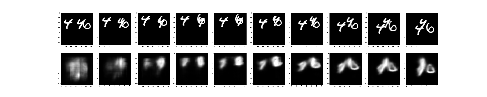
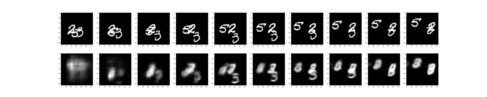

# ConvLSTM.pytorch

This repository is an unofficial pytorch implementation of 
[Convolutional LSTM Network: A Machine Learning Approach for Precipitation Nowcasting](https://arxiv.org/abs/1506.04214v1).
We reimplement the experiments in the paper based on the MovingMNIST dataset, which is followed by [Github](https://github.com/jhhuang96/ConvLSTM-PyTorch).
Detailed understanding is available on my [Blog](https://www.cnblogs.com/CZiFan/p/12630949.html).

## Requirements
- Pytorch>=0.4.0
- CPU or GPU
- Other packages can be installed with the following instruction:
```
pip install requirements.txt
```
  
## Quick start
Running the code with the following command, and the '--config' parameter represents different network architectures.
```
python main.py --config 3x3_16_3x3_32_3x3_64
```

## Results
| Model | Parameters(M) | Flops(G) | DiceLoss |
|---|---|---|---|
| 3x3_16_3x3_32_3x3_64 | 0.61 | 9.19 | 0.682311 | 
| 3x3_32_3x3_64_3x3_128 | 2.45 | 36.35 | 0.665905 |
* Note: In order to reduce the number of parameters and flops, 
we did not strictly follow the model architecture in the paper, but modified it into unet style structure.


## Citation

```
@inproceedings{xingjian2015convolutional,
  title={Convolutional LSTM network: A machine learning approach for precipitation nowcasting},
  author={Xingjian, SHI and Chen, Zhourong and Wang, Hao and Yeung, Dit-Yan and Wong, Wai-Kin and Woo, Wang-chun},
  booktitle={Advances in neural information processing systems},
  pages={802--810},
  year={2015}
}
```